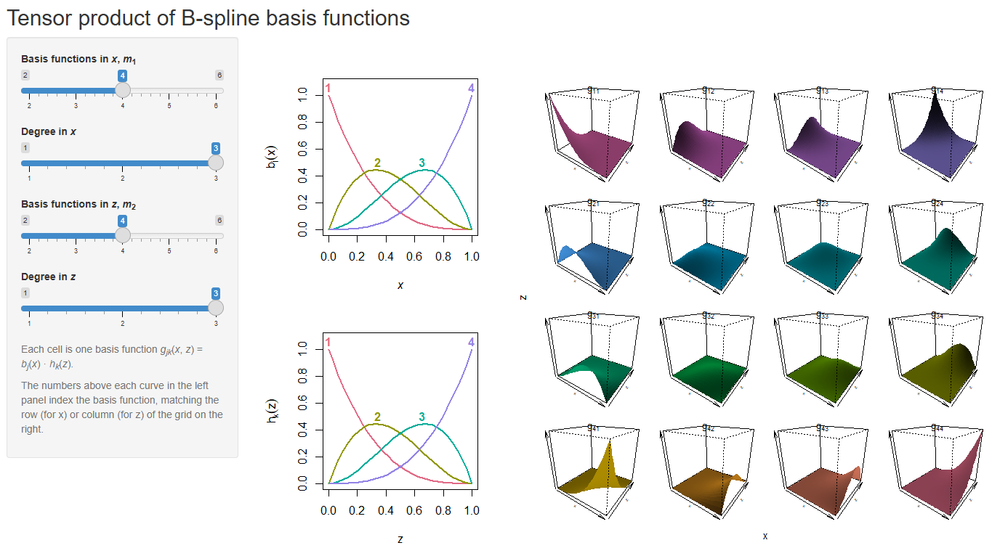
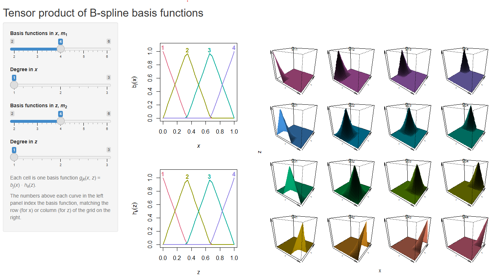
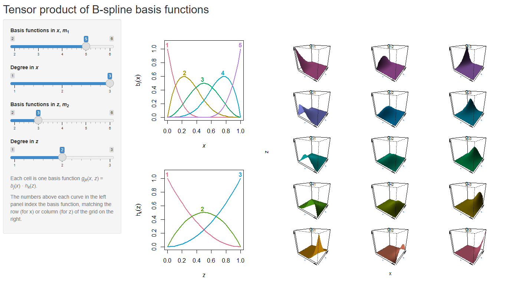

```{r}
#| message: false
#| warning: false

library(splines)
library(knitr)
```

This extension explores the construction of multidimensional splines, specifically focusing on how two one-dimensional B-spline bases combine to form a tensor product surface. While radial basis functions (such as thin-plate splines) offer isotropic smoothing in multiple dimensions, they assume that one unit of distance in $X_1$ is equivalent to one unit of distance in $X_2$. When covariates operate on entirely different scales or units, a tensor product spline is the mathematically appropriate alternative, allowing for asymmetric flexibility across differing dimensions.

To formalise this setting according to the multidimensional spline framework, suppose there are two predictors $X \in \mathbb{R}^2$. Let $b_j(X_1)$ be a set of $m_1$ basis functions for the first predictor, and $h_k(X_2)$ be a set of $m_2$ basis functions for the second. The $m_1 \times m_2$ dimensional tensor product basis is defined by all pairwise products:

$$g_{jk}(X) = b_j(X_1) \otimes h_k(X_2) = b_j(X_1)\,h_k(X_2), \qquad j = 1, \dots, m_1, \quad k = 1, \dots, m_2$$

A two-dimensional surface is then represented as a linear combination of these product functions: $g(X) = \sum_{j=1}^{m_1}\sum_{k=1}^{m_2} \theta_{jk}\, g_{jk}(X)$. Evaluated across $n$ observations, the new basis matrix $G$ becomes an $n \times (m_1 \times m_2)$ matrix, where each column is the element-wise multiplication of a column from the marginal $X_1$ basis and a column from the marginal $X_2$ basis.

Because the model remains strictly linear in the coefficients $\theta_{jk}$, it can be estimated using ordinary linear model machinery. However, this structure exposes the exact mechanical source of the curse of dimensionality due to the total number of parameters growing multiplicatively.

To make this mechanism visible, this extension translates the matrix algebra of tensor products into an interactive Shiny tool, allowing for the real-time visualization of how the choice of degree and basis size in each margin reshapes the resulting multidimensional surface.

### Algorithmic Implementation in Shiny

The interactive application bridges the mathematical template provided by the course slides with the reactive design principles of Wickham (2021). As expected the overall design is supposed to form a two a two-part system: a user interface that captures inputs, and a server that dictates the downstream computational flow. Rather than executing sequentially like a standard script, the server operates as a declarative reactive graph. It specifies precisely how outputs depend on inputs and updates only the necessary mathematical pathways when a user interacts with the tool.

This framework directly informs the implementation logic of the tensor product visualizer. In our logic, the core mathematical routines for basis construction and plotting are defined strictly outside the server environment. Then, the server acts solely to connect the user interface to these external functions. The four slider inputs feed into a reactive expression that checks mathematical constraints, ensuring that the number of basis functions strictly exceeds the polynomial degree.

The core algorithmic focus remains the assembly of the tensor product matrix $G$. The marginal bases are computed using standard uniform interior knots on $[0, 1]$. To map the continuous formulation into a discrete evaluation grid, the tensor product is assembled via a double loop iterating over the columns of the marginal bases.

```{r}

# Evaluation grid on [0, 1] shared by both margins
ng <- 30
gg <- seq(0, 1, length.out = ng)

# B-spline basis with equally spaced interior knots and an intercept
marg_basis <- function(x, m, degree) {
  nk <- m - degree - 1
  kn <- seq(0, 1, length.out = nk + 2)[-c(1, nk + 2)]
  B  <- bs(x, knots = kn, degree = degree, intercept = TRUE,
           Boundary.knots = c(0, 1))
  matrix(B, nrow = length(x), ncol = m)
}

# Row-wise tensor product: column (j, k) is B1[, j] * B2[, k]
tensor_basis <- function(B1, B2) {
  m1 <- ncol(B1)
  m2 <- ncol(B2)
  G <- matrix(NA, nrow = nrow(B1), ncol = m1 * m2)
  ccol <- 1
  for (j in 1:m1) {
    for (k in 1:m2) {
      G[, ccol] <- B1[, j] * B2[, k]
      ccol <- ccol + 1
    }
  }
  G
}
```

The full application is given in the appendix and is run locally with `shiny::runApp()`. The left column shows the two marginal bases, $b_j(x)$ above and $h_k(z)$ below, and the right column shows the tensor product basis as a grid of surfaces in which row $j$ and column $k$ contain $g_{jk}(x, z) = b_j(x)\,h_k(z)$. Moving a slider changes the marginal basis on the left and rebuilds the grid on the right at once, so the relationship between the two is direct: the row of the grid varies with the $x$ basis and the column varies with the $z$ basis. Three configurations were saved from the application and are discussed in turn.

#### Cubic margins with no interior knots

```{r}
#| fig-cap: "Application output with $m_1 = m_2 = 4$ and cubic degree in both margins. Rows of the grid index the basis function in $x$ and columns index the basis function in $z$."
#| out-width: "100%"


```

The number of interior knots $K$ in a B-spline basis is governed by the structural relationship $K = m - (d + 1)$, where $m$ is the number of basis functions and $d$ is the polynomial degree. With $m_1 = m_2 = 4$ basis functions and a cubic degree, the number of interior knots evaluates exactly to zero. Without interior boundaries to restrict their domain, every marginal function remains nonzero across the entire unit interval. Consequently, the resulting tensor product functions are smooth, broad surfaces that overlap heavily across the unit square.

#### Linear margins with interior knots

```{r}
#| fig-cap: "Application output with $m_1 = m_2 = 4$ and linear degree in both margins."
#| out-width: "100%"


```

Holding the number of basis functions fixed at four and lowering the degree to one places two interior knots at $1/3$ and $2/3$, rendering each marginal function piecewise linear with compact support. The tensor product basis directly inherits this localized structure. Because the surfaces are formed by multiplying these piecewise linear margins, they exhibit sharp, visible kinks along the knot grid and remain strictly zero outside of their immediate rectangular neighborhoods.

#### Unequal margins

```{r}
#| fig-cap: "Application output with $m_1 = 5$ and cubic degree in $x$, and $m_2 = 3$ and quadratic degree in $z$."
#| out-width: "100%"


```

The final configuration uses different sizes and degrees in the two margins, with five cubic functions in $x$ and three quadratic functions in $z$, so that the grid of surfaces is rectangular with $5 \times 3 = 15$ panels. This is a situation that motivates the tensor product in practice, because the two predictors need not be measured on comparable scales nor require comparable flexibility. The construction accommodates this by allowing each margin its own basis. It also makes plain that the cost of the construction is the product of the margin sizes, with this being that adding a single function to one margin adds a whole row or column of surfaces, and therefore adds as many coefficients as there are functions in the other margin.

### Appendix: Application Code

The following code is the complete, self-contained application. The application is intentionally narrow. It displays only the basis and not a fitted surface, so it shows what the model is built from but not how the coefficients $\theta_{jk}$ combine these surfaces into an estimate or how a penalty would regularise them; the knots are equally spaced on the unit square, which sidesteps the questions of knot placement and of scaling the two predictors. It is also limited to two dimensions, which is where the visual grid remains legible.

```{r}
#| eval: false

library(shiny)
library(splines)

# Evaluation grid on [0, 1] shared by both margins
ng <- 30
gg <- seq(0, 1, length.out = ng)

# B-spline basis
marg_basis <- function(x, m, degree) {
  nk <- m - degree - 1
  kn <- seq(0, 1, length.out = nk + 2)[-c(1, nk + 2)]
  B  <- bs(x, knots = kn, degree = degree, intercept = TRUE,
           Boundary.knots = c(0, 1))
  matrix(B, nrow = length(x), ncol = m)
}

# Marginal B-splines; each curve tagged with its
# index at its peak so the reader can match a line to the corresp row/col
plot_marginals <- function(B1, B2, p) {
  op <- par(mfrow = c(2, 1), mar = c(4, 4.5, 3, 1))
  on.exit(par(op))
  
  col1 <- hcl.colors(p$m1, "Dark 3")
  matplot(gg, B1, type = "l", lty = 1, lwd = 2, ylim = c(0, 1.08),
          col = col1,
          xlab = expression(italic(x)), ylab = expression(b[j](x))
          )
  for (j in 1:p$m1) {
    imax <- which.max(B1[, j])
    text(gg[imax], B1[imax, j] + 0.06, labels = j,
         col = col1[j], cex = 1.0, font = 2)
  }
  
  col2 <- hcl.colors(p$m2, "Dark 3")
  matplot(gg, B2, type = "l", lty = 1, lwd = 2, ylim = c(0, 1.08),
          col = col2,
          xlab = expression(italic(z)), ylab = expression(h[k](z))
          )
  for (k in 1:p$m2) {
    imax <- which.max(B2[, k])
    text(gg[imax], B2[imax, k] + 0.06, labels = k,
         col = col2[k], cex = 1.0, font = 2)
  }
}

# one cell per tensor-product basis function
plot_tensor_persp <- function(m1, d1, m2, d2) {
  B1 <- marg_basis(gg, m1, d1)
  B2 <- marg_basis(gg, m2, d2)
  
  op <- par(mfrow = c(m1, m2),
            mar = c(0.3, 0.3, 1.4, 0.3),
            oma = c(2.5, 2.5, 3.8, 0.5))
  on.exit(par(op))
  
  cols <- hcl.colors(m1 * m2, "Dark 3", rev = TRUE)
  
  idx <- 0
  for (j in 1:m1) {
    for (k in 1:m2) {
      idx <- idx + 1
      Z <- outer(B1[, j], B2[, k])   # g_jk(x, z) = b_j(x) * h_k(z)
      
      persp(gg, gg, Z,
            theta    = 35, phi = 22,
            col      = cols[idx],
            shade    = 0.7,
            border   = NA,
            ticktype = "simple",     # ticks but no numeric labels
            cex.axis = 0.5,
            cex.lab  = 0.55,
            xlab = "x", ylab = "z", zlab = "",
            zlim = c(0, 1),
            box  = TRUE)
      
      mtext(bquote(g[.(j) * .(k)]),
            side = 3, line = -1.1, cex = 0.8, font = 2)
    }
  }
  
  mtext("x", side = 1, outer = TRUE, line = 1.0, cex = 0.9)
  mtext("z", side = 2, outer = TRUE, line = 1.0, cex = 0.9)
}

ui <- fluidPage(
  titlePanel("Tensor product of B-spline basis functions"),
  
  sidebarLayout(
    sidebarPanel(
      width = 3,
      sliderInput("m1", HTML("Basis functions in <i>x</i>, <i>m</i><sub>1</sub>"),
                  min = 2, max = 6, value = 4, step = 1),
      sliderInput("d1", HTML("Degree in <i>x</i>"),
                  min = 1, max = 3, value = 3, step = 1),
      sliderInput("m2", HTML("Basis functions in <i>z</i>, <i>m</i><sub>2</sub>"),
                  min = 2, max = 6, value = 4, step = 1),
      sliderInput("d2", HTML("Degree in <i>z</i>"),
                  min = 1, max = 3, value = 3, step = 1),
      
      helpText("Each cell is one basis function ",
               HTML("<i>g<sub>jk</sub></i>(<i>x</i>, <i>z</i>) = ",
                    "<i>b<sub>j</sub></i>(<i>x</i>) \u00b7 <i>h<sub>k</sub></i>(<i>z</i>).")),
      helpText("The numbers above each curve in the left panel index the ",
               "basis function, matching the row (for x) or column ",
               "(for z) of the grid on the right.")
    ),
    
    mainPanel(
      width = 9,
      fluidRow(
        column(4, plotOutput("marg", height = "700px")),
        column(8, plotOutput("tp",   height = "700px"))
      )
    )
  )
)

server <- function(input, output, session) {
  
  # Validate once; every downstream reactive inherits the message
  pars <- reactive({
    validate(need(input$m1 > input$d1 && input$m2 > input$d2,
                  "The number of basis functions must exceed the degree in each margin."))
    list(m1 = input$m1, d1 = input$d1, m2 = input$m2, d2 = input$d2)
  })
  
  B1 <- reactive(marg_basis(gg, pars()$m1, pars()$d1))
  B2 <- reactive(marg_basis(gg, pars()$m2, pars()$d2))
  
  output$marg <- renderPlot(plot_marginals(B1(), B2(), pars()), res = 96)
  
  output$tp <- renderPlot({
    p <- pars()
    plot_tensor_persp(p$m1, p$d1, p$m2, p$d2)
  }, res = 96)
}

shinyApp(ui, server)
```

### References

Wickham, H. (2021). *Mastering Shiny*. O'Reilly Media. https://mastering-shiny.org
